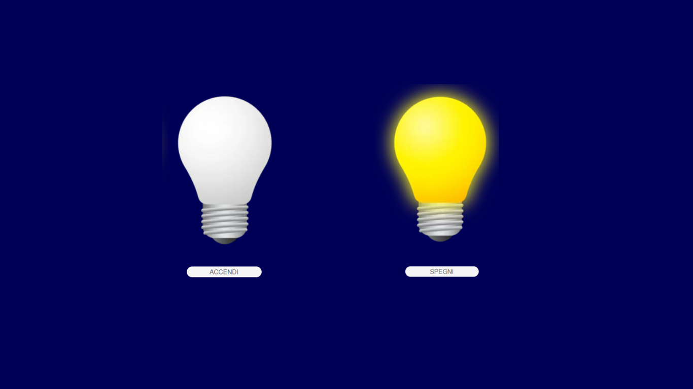

# js-dom-1

## 🇬🇧 English Version

### # Overview

Introductory DOM manipulation exercise focused on updating elements on the page in response to user interaction.  
The goal is to display a lightbulb image and change it when the user clicks a button.

---

## # Assignment Summary

### **Base Exercise**

The exercise required to:

- Create the repository `js-dom-1`
- Insert on the page:
  - the image of the **lightbulb off**
  - a button labeled **“Accendi”**
- Change the image to the **lightbulb on** when the user clicks the button

### **Bonus**

- Implement a toggle behaviour:
  - On the first click → bulb turns **on** and button text becomes **“Spegni”**
  - On the next click → bulb turns **off** and button text becomes **“Accendi”**
  - And so on, alternating state
- The method `string.includes()` may be useful for checking button text

---

## 🇮🇹 Versione Italiana

### # Panoramica

Esercizio introduttivo sul DOM, con l’obiettivo di modificare elementi della pagina in base alle azioni dell’utente.  
Si deve mostrare una lampadina e farla accendere tramite un bottone.

---

## # Riassunto della Consegna

### **Esercizio Base**

La consegna richiedeva di:

- Creare la repository `js-dom-1`
- Inserire nella pagina:
  - l’immagine della **lampadina spenta**
  - un bottone con la scritta **“Accendi”**
- Al click del bottone sostituire l’immagine con quella della **lampadina accesa**

### **Bonus**

- Implementare il comportamento di accensione/spegnimento:
  - Primo click → lampadina **accesa**, bottone = **“Spegni”**
  - Secondo click → lampadina **spenta**, bottone = **“Accendi”**
  - Procedere alternando nei click successivi
- Il metodo `string.includes()` può essere utile per controllare il testo del bottone
